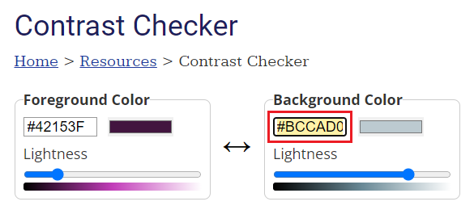
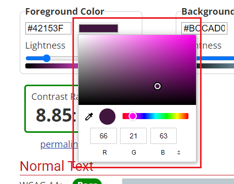
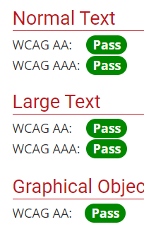

### Task 1

Open the [contrast checker](https://webaim.org/resources/contrastchecker/){:target="_blank"} website.

### Task 2

Under 'Background color' enter the hex code for your background colour. `primary`, `secondary` and `tertiary` are all background colours. 

### Task 3

**Choose**: To the left of the 'Background color' section is a 'Foreground color' section. 

Use the colour picker to pick a colour that you think will work well with your background colour. 

**Note** that it must be a contrasting colour. If your background colour is dark then use a light foreground colour. 

### Task 4

**Check** that you have chosen a contrasting colour by looking at the statuses below. They should all be 'Pass'.

If the status for your colour is not showing as 'Pass' then you can slide the 'Lightness' bar until they do.

### Task 5

Copy and paste the contrasting hex code colour into your colour palette. You need to find contrasting colours for:

+ `onprimary`
+ `onsecondary`
+ `ontertiary`

