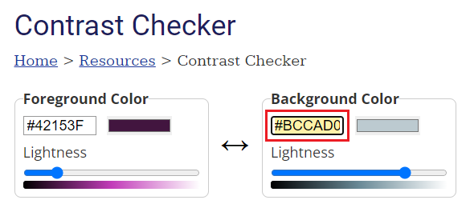
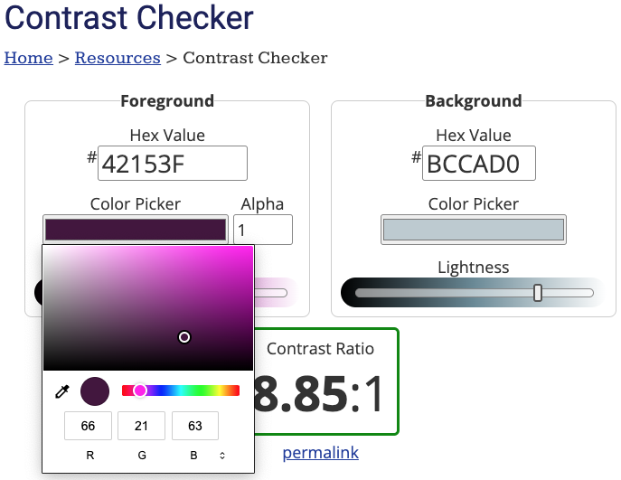
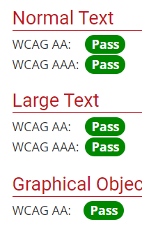

### Tâche 1

Ouvre le site web [Contrast Checker](https://webaim.org/resources/contrastchecker/){:target="_blank"}.

### Tâche 2

Under the 'Background' heading, enter the hex code for your background colour. Les couleurs « primaire », « secondaire » et « tertiaire » sont toutes des couleurs d'arrière-plan.

### Tâche 3

**Choose**: To the left of the 'Background' section is a 'Foreground' section.

Utilise le sélecteur de couleurs pour choisir une couleur qui, selon toi, s'accorde bien avec la couleur de ton arrière-plan.

**Remarque** que tu dois choisir une couleur contrastée. Si la couleur de ton arrière-plan est foncée, alors utilise une couleur de premier plan claire.

### Tâche 4

**Vérifie** que tu as choisi une couleur contrastée en regardant les statuts ci-dessous. Ils devraient tous être « Pass ».

Si le statut de ta couleur n'est pas « Pass », tu peux faire glisser la barre « Lightness » jusqu'à ce que ce soit le cas.

Animation de la barre de statut déplacée vers la gauche et des statuts passant à "Pass" (images/adjust-contrast.gif)

### Tâche 5

Copie et colle le code hexadécimal des couleurs contrastées dans ta palette de couleurs. Il faut que tu trouves des couleurs contrastées pour :

- `onprimary`
- `onsecondary`
- `ontertiary`
