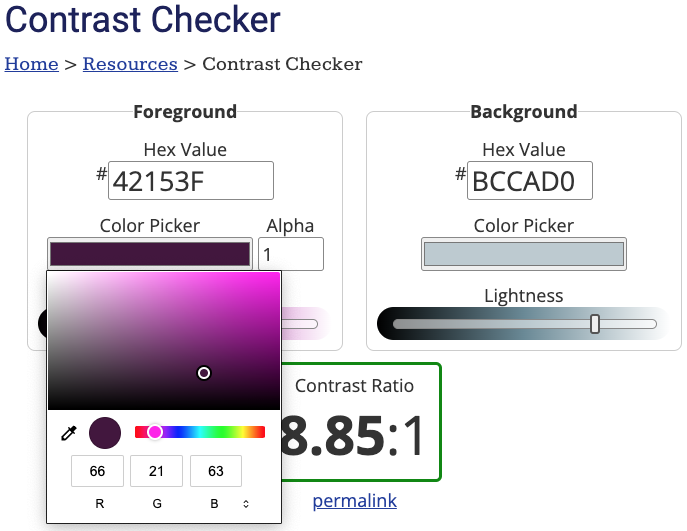
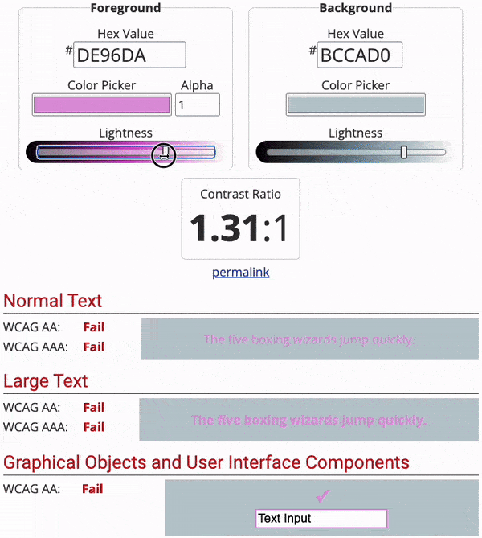

### Taak 1

Open de website [Contrastchecker](https://webaim.org/resources/contrastchecker/){:target="_blank"}.

### Taak 2

Under the 'Background' heading, enter the hex code for your background colour. 'primair', 'secundair' en 'tertiair' zijn allemaal achtergrondkleuren.

### Taak 3

**Choose**: To the left of the 'Background' section is a 'Foreground' section.

Gebruik de kleurenkiezer (Color Picker) om een kleur te kiezen die volgens jou goed werkt met je achtergrondkleur.

**Let op** dat je een contrasterende kleur moet kiezen. Als je achtergrondkleur donker is, gebruik dan een lichte voorgrondkleur.

### Taak 4

\*\*Controleer \*\* dat je een contrasterende kleur hebt gekozen door naar de onderstaande statussen te kijken. Ze moeten allemaal 'Pass' zijn.

Als de status voor je kleur niet als 'Pass' wordt weergegeven, kun je de 'Lightness'-balk verschuiven totdat dit wel het geval is.

### Taak 5

Kopieer en plak de hexadecimale code voor de contrasterende kleuren in je kleurenpalet. Je moet contrasterende kleuren vinden voor:

- `onprimary`
- `onsecondary`
- `ontertiary`
