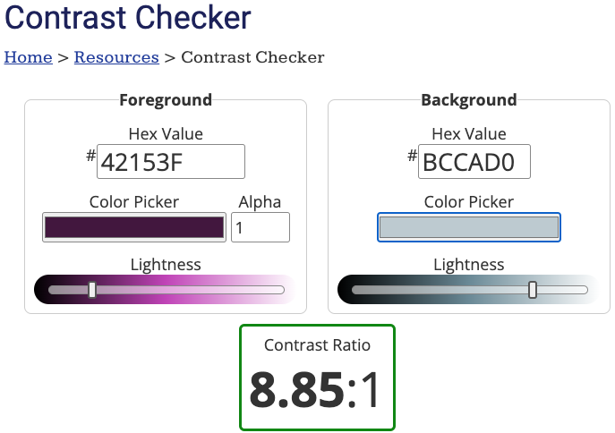
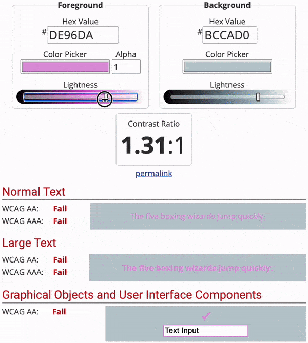

### 任务 1

打开 [对比度检查器](https://webaim.org/resources/contrastchecker/){:target="_blank"} 网站。

### 任务 2

在“Background”标题下，输入背景颜色的十六进制代码。 `primary`，`secondary` 和 `tertiary` 都是背景颜色。

### 任务 3

**选择**：“Background” 部分的左侧是 ”Foreground“ （前景）部分。

使用颜色选择器选择你认为与背景颜色相配的颜色。

**注意**你必须选择对比色。 如果背景颜色较暗，则使用浅色前景色。

### 任务 4

通过查看以下状态来**检查**你是否选择了对比色。 它们都应该是 “Pass”。

如果你的颜色状态未显示为“Pass”，那么你可以滑动“Lightness”栏直到显示为止。

### 任务 5

将对比色的十六进制代码复制并粘贴到你的调色板中。 你需要找到以下颜色的对比色：

- `onprimary`
- `onsecondary`
- `ontertiary`

